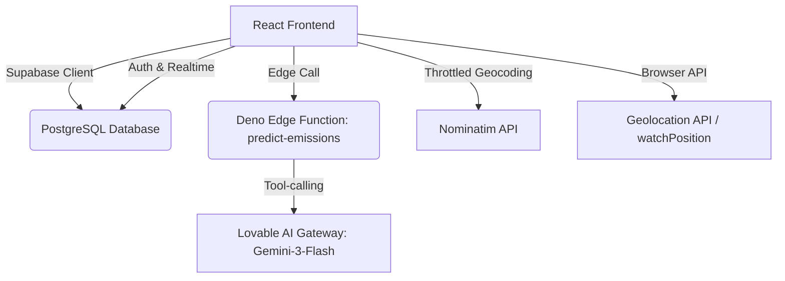

# GreenTrace India
**Enterprise ESG & Carbon Intelligence Platform**

[](https://greentrace.lovable.app)
[](https://github.com/)
[](https://github.com/)

## Table of Contents
1. [Overview](#overview)
2. [Live Demo & Screenshots](#live-demo--screenshots)
3. [Core Features](#core-features)
4. [Tech Stack](#tech-stack)
5. [Architecture](#architecture)
6. [Project Structure](#project-structure)
7. [Database Schema](#database-schema)
8. [The GPS Engine (AutoTracker)](#the-gps-engine-autotracker)
9. [Carbon Calculator & Emission Factors](#carbon-calculator--emission-factors)
10. [Predictive Analytics](#predictive-analytics)
11. [ESG Reporting & Verification](#esg-reporting--verification)
12. [Design System](#design-system)
13. [Getting Started](#getting-started)
14. [Available Scripts](#available-scripts)
15. [Deployment](#deployment)
16. [Security & Privacy](#security--privacy)
17. [Localization for India](#localization-for-india)
18. [Roadmap & Future Work](#roadmap--future-work)
19. [Contributing](#contributing)
20. [Acknowledgements](#acknowledgements)

---

## Overview

GreenTrace India is a 100% real-world-data, GPS-verified carbon emissions tracking and reduction platform built specifically for Indian individuals and enterprises. 

**The Zero-Mock Policy**
GreenTrace strictly adheres to a "Zero-Mock" data principle. Every metric on the screen comes from a real signal. When live signals or data are unavailable, the UI explicitly shows waiting states rather than fabricating data:
* **AutoTracker:** "Acquiring satellite signal..." / "Searching for satellites..."
* **SmartMeter:** "Waiting for Real-World Data — Connecting to Indian Power Grid data stream..."
* **PredictiveAI:** "Awaiting Real-World Data — Log at least 3 activities to unlock regression analysis"
* **CarbonHeatmap:** "Heatmap appears after logging activities"
* **EmissionsChart:** "Chart will appear once you log activities"
* **AuditTrail:** "Waiting for database writes..."
* **ActivityList:** "No activities logged yet. Start tracking your carbon footprint!"

---

## Live Demo & Screenshots

* **Live App:** [https://greentrace.lovable.app](https://greentrace.lovable.app)
* **Preview Environment:** [Lovable Preview Link](https://id-preview--3e9e92fa-efb4-4ece-997a-4c417e9d30f9.lovable.app)

*(Screenshot placeholders)*
* `[Dashboard View]`
* `[AutoTracker Live GPS]`
* `[Organization Analytics]`

---

## Core Features

### Enterprise & Org Intelligence
* **Organization View:** Campus footprint, active employees, avg per employee, and department-by-department INR waste bars. Includes "Greenest Employee of the Month".
* **Department Challenges:** Inter-department competitions (e.g., no-car goals).
* **Leaderboard:** Realtime department Green Scores calculated as `(1000 - (avgEmissions * 10))`.
* **ESG PDF:** Audit-ready 2-page report generation.
* **Smart Grid:** Live monitor showing India grid intensity.
* **Audit Trail:** Footer ticker displaying encrypted and verified database writes.
* **Privacy Mode:** GDPR-style anonymization switch.

### Individual Tracking
* **Dashboard:** 11-tab interface with StatsCards, animated CarbonGauge vs a daily 8.0 kg CO2 budget, and EcoTips.
* **AutoTracker:** Live 693-line GPS engine for automated commute logging.
* **QR Check-in:** Generate and scan simulated QR codes for instant trip logging.
* **Activity Logger:** Manual tracking with Transport, Diet, and Utility tabs.
* **Marketplace & Offsets:** Hardcoded sustainable products and local Indian offset projects with a budget slider (INR 100 - 10,000) and Certificate PDF generation.

### AI & Analytics
* **Linear Regression:** Local OLS regression detecting anomalies and projecting emissions.
* **AI Deep Analysis:** Edge function integrated with Gemini-3 generating tailored roadmaps.
* **Carbon Heatmap:** 7x4 day/time-slot hotspot grid.
* **Emissions Chart:** Stacked area charts mapping transport, diet, and utility trends via Recharts.

---

## Tech Stack

### Frontend
| Technology | Description |
| :--- | :--- |
| **React 18.3.1** | Core UI framework with TypeScript 5.8.3 |
| **Vite 5.4.19** | Build tool with `@vitejs/plugin-react-swc` |
| **Routing & State** | React Router DOM 6.30.1, TanStack React Query 5.83.0 |
| **Styling** | Tailwind CSS 3.4.17, shadcn/ui, next-themes 0.3.0 |
| **Animation** | Framer Motion 12.35.2 |
| **Visualization** | Recharts 2.15.4, Leaflet 1.9.4 / React-Leaflet 5.0.0 |
| **Utilities** | jsPDF 4.2.0, qrcode.react 4.2.0, date-fns 3.6.0, react-hook-form 7.61.1, zod 3.25.76, sonner 1.7.4 |

### Backend & Tooling
| Layer | Technology |
| :--- | :--- |
| **BaaS** | Lovable Cloud (managed Supabase @2.95.3), PostgreSQL, Auth, Realtime |
| **Edge Functions** | Deno-based (predict-emissions) |
| **AI Gateway** | Lovable AI Gateway (`google/gemini-3-flash-preview`) |
| **External API** | OpenStreetMap Nominatim (Throttled 1 req / 2s) |
| **Tooling** | ESLint 9, Vitest 3.2.4, Bun / npm, lovable-tagger 1.1.13 |

---

## Architecture


---

## Project Structure

```text
GreenTrace/
├── public/                          # Static assets (robots.txt)
├── src/
│   ├── components/                  # 26 feature components + shadcn/ui suite
│   │   ├── AutoTracker.tsx          # 693-line live GPS engine
│   │   ├── ESGReport.tsx            # 2-page PDF generator
│   │   ├── PredictiveAI.tsx         # Linear regression + AI deep analysis
│   │   ├── ui/                      # ~50 base shadcn components
│   │   └── ...                      
│   ├── contexts/AuthContext.tsx     # Supabase auth + profile fetching
│   ├── hooks/                       # useActivities, useReverseGeocode
│   ├── integrations/                # Supabase auto-generated types
│   ├── lib/
│   │   ├── carbonCalculator.ts      # 508-line OOP engine
│   │   ├── linearRegression.ts      # OLS regression + anomalies
│   │   └── utils.ts                 
│   ├── pages/                       # Auth, Index, NotFound
│   ├── test/                        # Vitest setup
│   └── index.css                    # Eco-Dark Theme tokens
├── supabase/
│   ├── functions/predict-emissions/ # Deno edge function
│   └── migrations/                  # 11 SQL migrations
├── .env                             # Environment variables
└── package.json                     # Bun/npm configuration
```
---

## Database Schema

The database relies on PostgreSQL via Supabase with strictly enforced Row-Level Security (RLS) across 11 migrations.

*   **profiles**: One row per user. Stores `display_name`, `employee_id`, `department`, and a `green_goal` (default 100 kg CO₂).
*   **activities**: Every logged carbon event (transport, diet, utility). Features owner-only CRUD RLS and Realtime broadcasting.
*   **tracking_sessions**: Live GPS sessions. Stores `status` (active/completed), `distance_traveled`, and a `breadcrumbs` JSONB array (capped at 500 points).
*   **departments**: Organizational groups for campus-wide footprint tracking.
*   **department_members**: User-to-department mapping. Uses a `SECURITY DEFINER` function to prevent RLS recursion and org-wide member enumeration.
*   **department_challenges**: Inter-department competitions with specific goal types (e.g., 'no-car').

---

## The GPS Engine (AutoTracker)

The `AutoTracker.tsx` is a high-precision, 693-line engine that avoids simulation in favor of real hardware signals.

*   **Precision Filtering**: Discards GPS drift noise less than 2 meters (`NOISE_THRESHOLD_KM = 0.002`).
*   **Geofencing**: Automatically detects entry/exit for the VNRVJIET Campus (17.4435, 78.3772) and Home Zones.
*   **Cloud Sync**: Persists state to the database every 10 seconds or immediately when the tab is hidden.
*   **Speed Detection**: Triggers "High Intensity" alerts if speeds exceed 20 km/h, suggesting a switch to 'metro' or 'shared' modes.
*   **Auto-Logging**: Automatically creates a `TransportActivity` segment every 50 meters.

---

## Carbon Calculator & Emission Factors

The OOP-based engine in `src/lib/carbonCalculator.ts` uses industrial-grade patterns to ensure consistent calculations.

### Key Emission Factors (kg CO₂)
| Category | Type | Factor | Unit |
| :--- | :--- | :--- | :--- |
| **Grid** | Electricity (India) | 0.82 | per kWh |
| **Transport** | Petrol / Diesel | 0.21 / 0.27 | per km |
| **Transport** | Auto-rickshaw | 0.10 | per km |
| **Transport** | Two-wheeler | 0.08 | per km |
| **Transport** | Metro | 0.03 | per km |
| **Diet** | Vegetarian / Vegan | 0.86 / 0.43 | per serving |
| **Diet** | Beef / Mutton | 6.61 / 5.50 | per serving |

### Financial Translation (Waste in INR)
*   **Transport Waste**: kg CO₂ × ₹12
*   **Electricity Waste**: kg CO₂ × ₹9.76 (calculated at ₹8/kWh × 0.82 grid factor)
*   **Diet Waste**: kg CO₂ × ₹5

---

## Predictive Analytics

**Local Regression (`src/lib/linearRegression.ts`)**
Executes pure-TypeScript Ordinary Least Squares (OLS) regression on daily emission totals. Provides slope, intercept, R2, and a residual-based Z-score anomaly detection system flagging any `|Z| > 2` as a significant spike or drop.

**AI Deep Analysis (`predict-emissions`)**
A Deno-based edge function routing through the Lovable AI Gateway to `google/gemini-3-flash-preview`. It generates tailored roadmaps and risk levels (Low/Medium/High) based on Indian fuel and grid baselines.

---

## ESG Reporting & Verification

The `ESGReport.tsx` module generates audit-ready, 2-page PDFs entirely client-side using `jsPDF`.

*   **Executive Summary**: Displays total emissions, activity counts, and financial waste in INR.
*   **Strategic Roadmap**: Provides a C-Suite summary with a Risk Level computed against an annual 2,000 kg CO₂ budget.
*   **Digital Verification**: Includes a unique `Report ID: GT-{base36 timestamp}` and a visual QR-style placeholder.

---

## Design System

**Theme**: "Eco-Dark / Deep Forest" using HSL tokens.
*   **Core Colors**: Background `160 30% 5%`, Primary `140 35% 50%` (Sage Green).
*   **Typography**: 'Inter' for body text and 'Space Grotesk' for display headings.
*   **Visuals**: Includes a reactive `AuroraBackground` that shifts colors as emissions rise and a monospace `SystemStatusBar` for live grid/GPS telemetry.

---

## Getting Started

### Prerequisites
*   Node.js ≥ 18 (or Bun ≥ 1.0)
*   Modern browser with Geolocation API support
*   HTTPS or localhost (required for `watchPosition`)

### Installation
1.  Clone the repository.
2.  Install dependencies: `npm install`
3.  Configure your `.env` with `VITE_SUPABASE_URL` and `VITE_SUPABASE_ANON_KEY`.
4.  Push the database schema: `supabase db push`

---

## Available Scripts

| Command | Description |
| :--- | :--- |
| `npm run dev` | Starts Vite dev server with HMR |
| `npm run build` | Generates production build |
| `npm run test` | Executes Vitest suite |
| `npm run lint` | Runs ESLint over the project |

---

## Security & Privacy

*   **Hardened RLS**: All database tables enforce `auth.uid() = user_id`.
*   **Data Minimization**: Public profile data is exposed only through a strictly limited RPC (`get_public_profiles`).
*   **Input Validation**: `ValidationError` range checks in the calculator prevent DoS via extreme inputs.
*   **Privacy Mode**: A dedicated GDPR-style toggle allows users to anonymize their data.

---

## Localization for India

*   **Currency**: All financial data rendered in ₹ via `en-IN` locale.
*   **Grid Intensity**: 0.82 kg CO₂/kWh baseline (referencing CEA/POSOCO).
*   **Transport**: Native support for Auto-rickshaws and Two-wheelers.
*   **Offsets**: Features local projects like Trees in Western Ghats and Mangroves in Sundarbans.

---

## Roadmap & Future Work

*   **Native Mobile**: Background GPS tracking via React Native or Capacitor.
*   **PWA**: Offline-first capabilities and service worker support.
*   **Cryptography**: Implementing true SHA-256 hashing for ESG PDF verification.
*   **Live Grid**: Real-time integration with live CEA/POSOCO APIs.
*   **Role-Based Access**: Deployment of the `user_roles` RBAC system.

---

## Acknowledgements

*   **Infrastructure**: Lovable Cloud & Supabase
*   **AI**: Lovable AI Gateway (Gemini 3 Flash)
*   **Data**: Central Electricity Authority (CEA) India
*   **UI**: shadcn/ui & Framer Motion

---

*Built for a greener tomorrow.*
